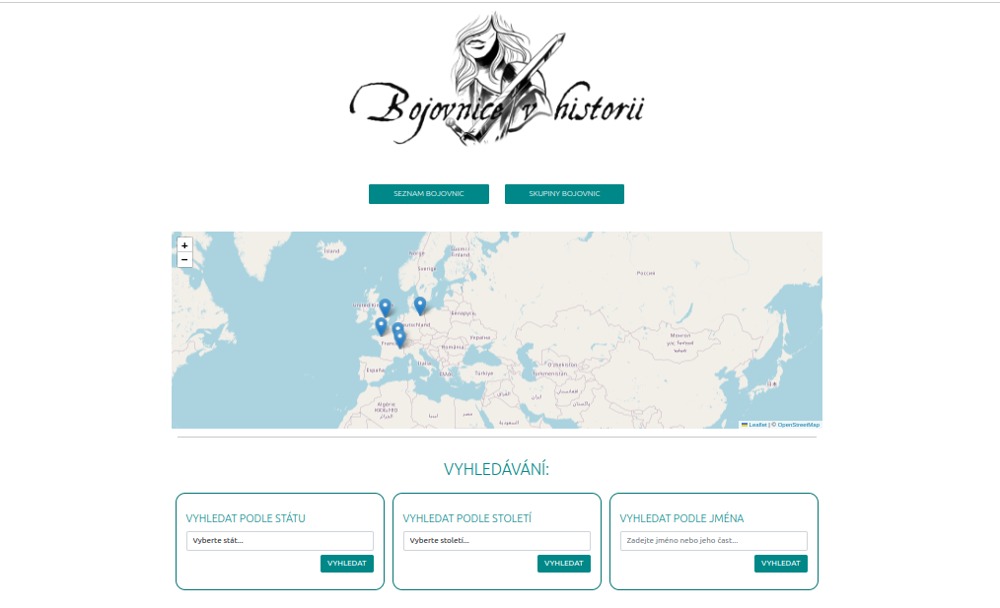

# Databáze bojovnic v historii světa

Tato aplikace slouží k vytvoření, editaci a zveřejnění databáze historických osobností. Je rozdělena do čtyř částí. 

1. bojovnice_app - uživatelské část aplikace: tato část slouží k prohlížení hlavních dat databáze. Je možné zobrazit kompletní seznamy či data filtrovat.

2. sprava - správcovská část aplikace: tato část aplikace slouží z zobrazení kompletní databáze a její editaci, případně je možné konkrétní data stahovat jako .txt soubor. Tato část je zaheslovaná - je určena pouze pro správce. Mazání dat z databáze je pak povoleno pouze administrátorovi.

3. bojovnice_api - Django REST framework rozhraní pro získání dat z hlavních modelů databáze (bojovnice a skupiny bojovnic) pomocí api. Tato část je přístupná všem, proto podporuje pouze metodu GET.

4. Django admin - administrativní rozhraní předpřipravené Djangem. Nastaveno tak, aby také sloužilo k zobrazení a editaci celé databáze a hlavně k editaci správcovnských přístupů. 

## O projektu

Aplikace byla postavena pomocí frameworku Django 4.2.

Grafické rozhraní bylo postaveno pomocí Bootstrap 5 a ve výjimečných případech doladěné pomocí CSS. Design aplikace je responzivní. 

API rozhraní bylo postaveno na Django REST framework. 
## Instalace knihoven

Aplikace používá několik knihoven třetí stran. Kompletní seznam najdete v souboru requirements.txt a instalovat je můžete příkazem:

    pip install -r requirements.txt
## Ukázka aplikace

UŽIVATELSKÁ ČÁST APLIKACE:

SPRÁVCOVSKÁ ČÁST APLIKACE:

API ROZHRANÍ: 

DJANGO ADMIN:
